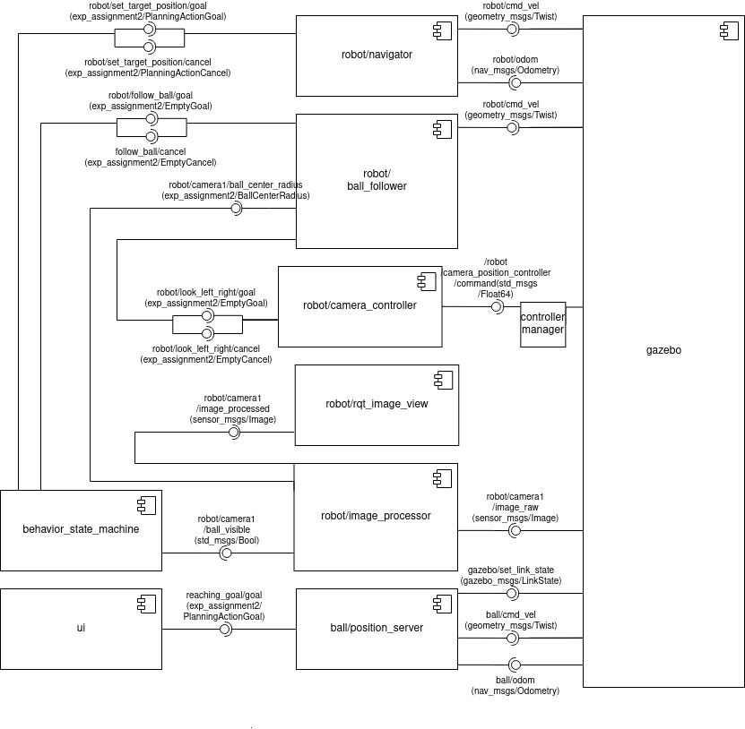
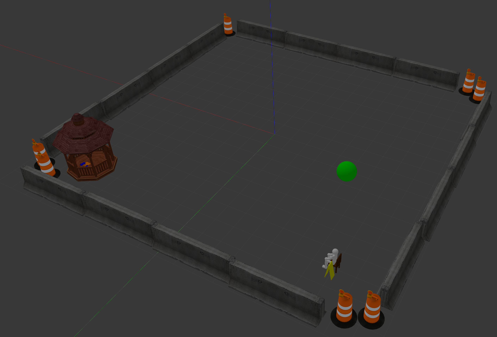
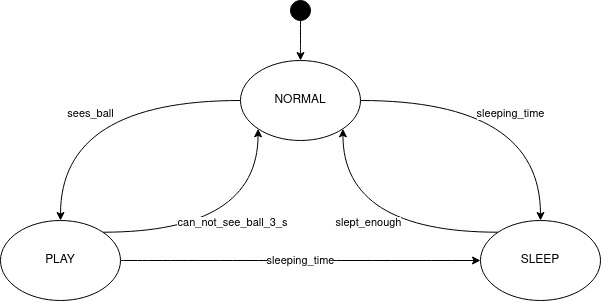

# exp_assignment2
<!-- PROJECT SHIELDS -->
<!--
*** I'm using markdown "reference style" links for readability.
*** Reference links are enclosed in brackets [ ] instead of parentheses ( ).
*** See the bottom of this document for the declaration of the reference variables
*** for contributors-url, forks-url, etc. This is an optional, concise syntax you may use.
*** https://www.markdownguide.org/basic-syntax/#reference-style-links
-->
[![Contributors][contributors-shield]][contributors-url]
[![Forks][forks-shield]][forks-url]
[![Stargazers][stars-shield]][stars-url]
[![Issues][issues-shield]][issues-url]
[![MIT License][license-shield]][license-url]
[![LinkedIn][linkedin-shield]][linkedin-url]


<!-- PROJECT LOGO -->
<br />
<p align="center">
  <h3 align="center">EXP_ASSIGNMENT2</h3>

  <p align="center">
    This repository contains the second assignment of the experimental robotics laboratory course 2020 at the University of Genoa.
    It can be used to play around with ros. It contains only simulations, so no special hardware is needed.
    The doxygen-documantation of the code can be found here:
    <br />
    <a href="https://filiphesse.github.io/exp_assignment2/"><strong> « « API » » </strong></a>
    <br />
    <br />
    <a href="https://github.com/FilipHesse/exp_assignment2/issues">Report Bug</a>
    ·
    <a href="https://github.com/FilipHesse/exp_assignment2/issues">Request Feature</a>
  </p>
</p>


<!-- TABLE OF CONTENTS -->
## Table of Contents

- [exp_assignment2](#exp_assignment2)
  - [Table of Contents](#table-of-contents)
  - [About The Project](#about-the-project)
    - [Built With](#built-with)
  - [Software architecture](#software-architecture)
    - [Component Diagram](#component-diagram)
    - [Launchfiles](#launchfiles)
    - [Ros parameters](#ros-parameters)
    - [Messages, services and actions](#messages-services-and-actions)
    - [State Machine](#state-machine)
  - [Packages and file list](#packages-and-file-list)
  - [Getting Started](#getting-started)
    - [Prerequisites](#prerequisites)
    - [Installation](#installation)
  - [Usage](#usage)
  - [Working hypothesis and environment](#working-hypothesis-and-environment)
  - [Systems features](#systems-features)
  - [Systems limitations](#systems-limitations)
  - [Possible technical improvements](#possible-technical-improvements)
  - [License](#license)
  - [Contact](#contact)


<!-- ABOUT THE PROJECT -->
## About The Project

The aim of this assignments is to get acquainted with working with gazebo
simulations including plugins like sensors and controllers. It is based on the first assignment, where parts of this code were implemented already:
* [assignment1](https://github.com/FilipHesse/experimental_robotics_lab1)

A wheeled robot moves in a simulated environment, where there is also a ball model,
that is arbitrarily moving around. The robot has a simulated camera on top of his head.
When the robot sees the ball, it starts to follow it.
When the robot is close enough to the ball and the ball is not moving, the robot looks to the left, then to the right and then to the front again. When the robots looses the robot (does not see it for 3 seconds), it starts moving arbitrarily again.
At some arbitrary moments, the robot goes to a gazebo to sleep for a random time period (within specific bounds).

### Built With

* [ROS noetic](http://wiki.ros.org/noetic/Installation)
* [Python3](https://www.python.org/downloads/)
* [Smach](http://wiki.ros.org/smach)
* [Gazebo](http://gazebosim.org/)

## Software architecture

### Component Diagram


The ROS package robot_pet consist of 9 components which are
* <strong>ui</strong> :
  * This node is the simulated user interface to create target positions for the ball. These positions are then sent to an action server (ball/position_server). The ball is moved to random positions at random times. The positions are uniformly random in the range from -8 to 8 for both coordinates (= map size) ,each fifth position has a negative z_value (ball should disappear). The time between two commands is uniformly random between 4 and 10 seconds.
* <strong>ball/position_server</strong> :
  * This is an action server node for navigating the ball to a point. It publishes velocities to control the ball to a desired point, that is specified in the action goal.
* <strong>behavior_state_machine</strong> :
  * This is the heart of robot_pet package, which defines the robots behavior
  * Contains a finite state machine implemented in smach. The 3 states of the
  robot pet are NORMAL, PLAY and SLEEP. The state diagram can be found below
  * Each interface with the ROS infrastructure, such as service clients,
  servers, action clients and publishers are implemented within separate
  classes. All these interfaces are then passed to the smach-states while they
  are constructed, in order to make the interfaces accessible for the states.
* <strong>robot/image_processor</strong> :
  * This node subscribes to the image topic of the camera on top of the robot and processes the image in the following way: It detects the green ball by performing color based image segmentation. The contour and the centroid are then computed. It publishes 3 topics:
    * Publishes, if the ball is visible (camera1/ball_visible)
    * Publishes the processed camera image with the marked contour and centroid of the ball
    * Publishes the ball center and radius (camera1/ball_center_radius)
* <strong>rqt_image_view</strong> :
  * That node is a built in ROS node, so it has not been implemented in this context. It is used to display the processed camera image with the ball
* <strong>robot/camera_controller</strong> :
  * This ROS continuously controls the camera link. The camera controller continuously publishes the angle zero to the camera_position_controller, which is handled by the controller manager. If the action look_left_right is called, the callback makes the robot look to the left (45°), then wait 2 seconds, then look to the right (45°), wait again for two seconds and finally look to the center. The action is preemptable after the waiting time of 2 seconds in the middle
* <strong>robot/ball_follower</strong> :
  * This node makes the robot follow the ball by publishing appropriate velocity commands. Image based visual servoing is implemented: the node knows from a subscribed topic (camera1/ball_center_radius) the position and the size of the ball in the image frame. From this information the node computes an angular and linear velocity such that the ball will be located in the image center with a specified size (-> distance).
* <strong>robot/navigator</strong> :
  * This is a ROS node, which allows to navigate the robot to desired points. An action server takes target positions and publishes computed velocities to reach them. A proportional controller with a threshold for the maximal speed is implemented. This way angular and linear velocities are computed to reach the target positions.
* <strong>gazebo</strong> :
  * Gazebo is used to simulate and visualize the entire environment. The following screenshot shows an overview of the setting:
  
  * The gazebo in the left corner is the house for the robot, where it goes to 'sleep'
  * The Robot is shown below. It is is driven with a differential controller. The two big wheels are motorized. The small castor wheel in the back is just an idler to make the robot stable. The head (blue) can be rotated around the z-axis is a range [-pi/4, +pi/4].
  

### Launchfiles

To launch the entire system, the following launchfile can be used:
* everything.launch

To properly observe, how the state machine is working, it is useful to launch two launch files separately. This allows to directly see only the loginfos from the state machine
* everything_without_state_machine.launch
* state_machine.launch

### Ros parameters

Several ROS parameters can be set to modify this software.
* /p_linear: linear proportional gain for the navigator
* /thr_linear: linear threshold for the navigator
* /p_angular: angular proportional gain for the navigator
* /thr_angular: angular threshold for the navigator

### Messages, services and actions

The following <strong>ROS-message</strong> has been defined:
* BallCenterRadius.msg: Contains the center and the radius of the ball in the image plane. Also contains a boolean flag showing, if the ball is visible.
```sh
std_msgs/Bool visible
std_msgs/Int64 center_x
std_msgs/Int64 center_y
std_msgs/Int64 radius
```
The following <strong>ROS-actions</strong> have been defined:
* Planning.action: In the goal section, the target_pose can be specified. The goal section is empty and the feedback section contains a string for the status and a current position.
```sh
geometry_msgs/PoseStamped target_pose
---
---
string stat
geometry_msgs/Pose position
```

* Empty.action: This is an empty action. It is used to activate the ball following and to cancel it.
```sh
---
---
```

### State Machine

The above state diagram shows clearly the three states of the system:
* NORMAL: The robot moves randomly from one position to another. It transitions to the PLAY state when it sees the ball. If the sleeping timer triggers sleeping time, then the state transitions to SLEEP.
* SLEEP: The robot approaches the house and stays there, until the sleeping timer triggers, that it's time to wake up (transition "slept_enough"). Then the robot returns to the state NORMAL
* PLAY: The robot follows the ball. When it has reached the ball and does not move anymore, then it looks to the left, waits, looks to the right, waits and finally looks back to the center. When the robot stops seeing the ball for 3 seconds, it returns to the state NORMAL. If the sleeping timer triggers "time_to_sleep", the robot transitions to the SLEEP state

## Packages and file list
The provided code contains only the package "exp_assignment2"
Inside that package all the nodes, models etc. are created.

```sh
exp_assignment2/
├── action
│   ├── Empty.action
│   └── Planning.action
├── CMakeLists.txt
├── config
│   ├── house.yaml
│   ├── motors_config.yaml
│   └── navigator_params.yaml
├── docs
│   ├── annotated.html
│   ├── bc_s.png
│   ├── ...
│   ...
├── Exp_Rob_assignment2.pdf
├── launch
│   ├── everything.launch
│   ├── everything_without_state_machine.launch
│   ├── rviz_with_joint_state_pub.launch
│   ├── state_machine.launch
│   ├── test_image_processor.launch
│   └── test_navigator.launch
├── msg
│   └── BallCenterRadius.msg
├── package.xml
├── README.md
├── rviz
│   └── rviz_cfg.rviz
├── scripts
│   ├── ball_follower.py
│   ├── behavior_state_machine.py
│   ├── camera_controller.py
│   ├── go_to_point_ball.py
│   ├── image_processor.py
│   ├── navigator.py
│   └── ui.py
├── urdf
│   ├── ball.gazebo
│   ├── ball.xacro
│   ├── human.urdf
│   ├── robot.gazebo
│   └── robot.xacro
└── worlds
    ├── gazebo
    │   ├── model.config
    │   └── model.sdf
    └── world_assignment.world

```
<!-- GETTING STARTED -->
## Getting Started

To get a local copy up and running follow these simple steps.

### Prerequisites

This package was developed on Ubuntu 20.04, using [ROS noetic](http://wiki.ros.org/noetic/Installation) and [Python3](https://www.python.org/downloads/) (Click on ROS or python for installation instructions)

### Installation
1. Create your catkin workspace

2. Create a folder /src inside the catkin workspace

1. Inside that folder clone the repo
```sh
git clone https://github.com/FilipHesse/exp_assignment2.git
```

<!-- USAGE EXAMPLES -->
## Usage

To run the project, perform the following steps (from catkin_ws):

1) Source the ros distribution
```sh
source /opt/ros/noetic/setup.bash
```
2) catkin_make the project, so all message files will be created
```sh
catkin_make
```
3) Type
```sh
source devel/setup.bash
```
4) Run the launchfile:
```sh
roslaunch exp_assignment2 everything.launch
```
Alternatively, for a better understanding of the state_machine loginfos run the following two launchfiles from two different terminals:
```sh
roslaunch exp_assignment2 everything_without_state_machine.launch
roslaunch exp_assignment2 state_machine.launch
```

For understanding the internal behavior, use the second alternative. All the nodes will start up. Gazebo will open and display the world with the robot and the ball. Another rqt_image_view window will open, that displays the processed camera image with the highlighted ball if visible.
The robot will start moving according to the described state machine. Now, it is useful to observe the terminal, where state_machine.launch was started. All state transitions and relevant events will be displayed. When the robot goes to sleep, it moves into gazebo, which does not have collision defined. It just aims to mark the position of the house/bed.

## Working hypothesis and environment
The pet is moving in a two dimensional domain in the range [-8, 8] for both coordinates. The random movements of the robot are always constrained stay inside those boundaries, no position commands beyond them are given. The navigating robot is not able to avoid any obstacles. The camera image processing does not take any light changes into account, so the system only works for sure in the given simulated setting.

## Systems features
The actions set_target_position, follow_ball and look_left_right are preemptable, so the state machine is able to change the states very quickly, when a corresponding event has occurred. The robot does not have to first finish one movement, before it can change its state to sleep for example.

The movements of the ball and the movements of the robot (in normal mode) are both randomized in time and space, so the systems functionality gets stressed very well.

The entire system does not have any long blocking behaviors in any node, which allows the system to stay responsive at any time.

The additional castor wheel and the motorized wheels in the front of the robot drastically increase stability of the mechanical robot model, which allows much faster accelerations than with the given robot model.

## Systems limitations
No obstacle avoidance mechanism has been implemented so far. For this reason the gazebo object does not contain collisions. The human model with the chair still does contain a collision. As a result, if the robot crashes into the person or any object of the boundaries, it might result in a dead-lock.

The control of the robots velocity (node "navigator") was tuned in a simple way without much effort to optimize it. In very rare situations (maybe when the robot crashed into an object), it may happen, that the control system becomes unstable and the robot drives in circles.

## Possible technical improvements
A mechanism could be implemented, that detects, if a robot crashed or can not reach the target, because there is an object in the way. A very simple idea to define a timeout timer, that detects, if reaching the goal takes much too long. Then, a new target could be sent to the robot, which might be in a different direction. This could at leas keep the simulation running autonomously.

A LiDAR sensor could be integrated to the robot, so it could automatically avoid obstacles. The robot velocity control (node "navigator") could be optimized by implementing a PID controller instead of just a P controller. Much faster and more precise navigations can be expected by such a measure.

<!-- LICENSE -->
## License

Distributed under the MIT License. See `LICENSE` for more information.


Project Link: [https://github.com/FilipHesse/exp_assignment2](https://github.com/FilipHesse/exp_assignment2)


## Contact

Filip Hesse - S4889393(at)studenti.unige.it


<!-- MARKDOWN LINKS & IMAGES -->
<!-- https://www.markdownguide.org/basic-syntax/#reference-style-links -->
[contributors-shield]: https://img.shields.io/github/contributors/FilipHesse/exp_assignment2.svg?style=flat-square
[contributors-url]: https://github.com/FilipHesse/exp_assignment2/graphs/contributors
[forks-shield]: https://img.shields.io/github/forks/FilipHesse/exp_assignment2.svg?style=flat-square
[forks-url]: https://github.com/FilipHesse/exp_assignment2/network/members
[stars-shield]: https://img.shields.io/github/stars/FilipHesse/exp_assignment2.svg?style=flat-square
[stars-url]: https://github.com/FilipHesse/exp_assignment2/stargazers
[issues-shield]: https://img.shields.io/github/issues/FilipHesse/exp_assignment2.svg?style=flat-square
[issues-url]: https://github.com/FilipHesse/exp_assignment2/issues
[license-shield]: https://img.shields.io/github/license/FilipHesse/exp_assignment2.svg?style=flat-square
[license-url]: https://github.com/FilipHesse/exp_assignment2/blob/master/LICENSE.txt
[linkedin-shield]: https://img.shields.io/badge/-LinkedIn-black.svg?style=flat-square&logo=linkedin&colorB=555
[linkedin-url]: https://linkedin.com/in/FilipHesse
[product-screenshot]: images/screenshot.png
