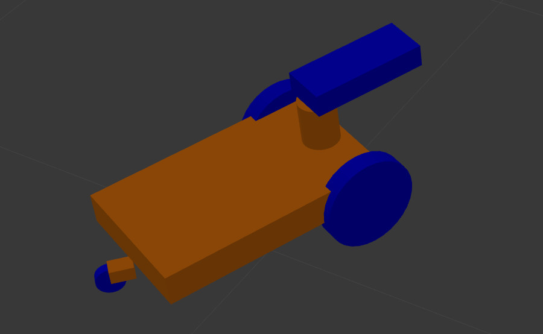

# exp_assignment2
<!-- PROJECT SHIELDS -->
<!--
*** I'm using markdown "reference style" links for readability.
*** Reference links are enclosed in brackets [ ] instead of parentheses ( ).
*** See the bottom of this document for the declaration of the reference variables
*** for contributors-url, forks-url, etc. This is an optional, concise syntax you may use.
*** https://www.markdownguide.org/basic-syntax/#reference-style-links
-->
[![Contributors][contributors-shield]][contributors-url]
[![Forks][forks-shield]][forks-url]
[![Stargazers][stars-shield]][stars-url]
[![Issues][issues-shield]][issues-url]
[![MIT License][license-shield]][license-url]
[![LinkedIn][linkedin-shield]][linkedin-url]


<!-- PROJECT LOGO -->
<br />
<p align="center">
  <h3 align="center">EXP_ASSIGNMENT2</h3>

  <p align="center">
    This repository contains the second assignment of the experimental robotics laboratory course 2020 at the University of Genoa.
    It can be used to play around with ros. It contains only simulations, so no special hardware is needed.
    The doxygen-documantation of the code can be found here:
    <br />
    <a href="https://filiphesse.github.io/exp_assignment2/"><strong> « « API » » </strong></a>
    <br />
    <br />
    <a href="https://github.com/FilipHesse/exp_assignment2/issues">Report Bug</a>
    ·
    <a href="https://github.com/FilipHesse/exp_assignment2/issues">Request Feature</a>
  </p>
</p>


<!-- TABLE OF CONTENTS -->
## Table of Contents

- [exp_assignment2](#exp_assignment2)
  - [Table of Contents](#table-of-contents)
  - [About The Project](#about-the-project)
    - [Built With](#built-with)
  - [Software architecture](#software-architecture)
    - [Component Diagram](#component-diagram)
    - [Launchfiles](#launchfiles)
    - [Ros parameters](#ros-parameters)
    - [Messages, services and actions](#messages-services-and-actions)
    - [State Machine](#state-machine)
  - [Packages and file list](#packages-and-file-list)
  - [Getting Started](#getting-started)
    - [Prerequisites](#prerequisites)
    - [Installation](#installation)
  - [Usage](#usage)
  - [Working hypothesis and environment](#working-hypothesis-and-environment)
  - [Systems features](#systems-features)
  - [Systems limitations](#systems-limitations)
  - [Possible technical improvements](#possible-technical-improvements)
  - [License](#license)
  - [Contact](#contact)


<!-- ABOUT THE PROJECT -->
## About The Project

The aim of this assignments is to get acquainted with working with gazebo
simulations including plugins like sensors and controllers. It is based on the first assignment, where parts of this code were implemented already:
* [assignment1](https://github.com/FilipHesse/experimental_robotics_lab1)

A wheeled robot moves in a simulated environment, where there is also a ball model,
that is arbitrarily moving around. The robot has a simulated camera on top of his head.
When the robot sees the ball, it starts to follow it.
When the robot is close enough to the ball and the ball is not moving, the robot looks to the left, then to the right and then to the front again. When the robots looses the robot (does not see it for 3 seconds), it starts moving arbitrarily again.
At some arbitrary moments, the robot goes to a gazebo to sleep for a random time period (within specific bounds).

### Built With

* [ROS noetic](http://wiki.ros.org/noetic/Installation)
* [Python3](https://www.python.org/downloads/)
* [Smach](http://wiki.ros.org/smach)
* [Gazebo](http://gazebosim.org/)

## Software architecture

### Component Diagram


The ROS package robot_pet consist of 9 components which are
* <strong>ui</strong> :
  * This node is the simulated user interface to create target positions for the ball. These positions are then sent to an action server (ball/position_server). The ball is moved to random positions at random times. The positions are uniformly random in the range from -8 to 8 for both coordinates (= map size) ,each fifth position has a negative z_value (ball should disappear). The time between two commands is uniformly random between 4 and 10 seconds.
* <strong>ball/position_server</strong> :
  * This is an action server node for navigating the ball to a point. It publishes velocities to control the ball to a desired point, that is specified in the action goal.
* <strong>behavior_state_machine</strong> :
  * This is the heart of robot_pet package, which defines the robots behavior
  * Contains a finite state machine implemented in smach. The 3 states of the
  robot pet are NORMAL, PLAY and SLEEP. The state diagram can be found below
  * Each interface with the ROS infrastructure, such as service clients,
  servers, action clients and publishers are implemented within separate
  classes. All these interfaces are then passed to the smach-states while they
  are constructed, in order to make the interfaces accessible for the states.
* <strong>robot/image_processor</strong> :
  * This node subscribes to the image topic of the camera on top of the robot and processes the image in the following way: It detects the green ball by performing color based image segmentation. The contour and the centroid are then computed. It publishes 3 topics:
    * Publishes, if the ball is visible (camera1/ball_visible)
    * Publishes the processed camera image with the marked contour and centroid of the ball
    * Publishes the ball center and radius (camera1/ball_center_radius)
* <strong>rqt_image_view</strong> :
  * That node is a built in ROS node, so it has not been implemented in this context. It is used to display the processed camera image with the ball
* <strong>robot/camera_controller</strong> :
  * This ROS continuously controls the camera link. The camera controller continuously publishes the angle zero to the camera_position_controller, which is handled by the controller manager. If the action look_left_right is called, the callback makes the robot look to the left (45°), then wait 2 seconds, then look to the right (45°), wait again for two seconds and finally look to the center. The action is preemptable after the waiting time of 2 seconds in the middle
* <strong>robot/ball_follower</strong> :
  * This node makes the robot follow the ball by publishing appropriate velocity commands. Image based visual servoing is implemented: the node knows from a subscribed topic (camera1/ball_center_radius) the position and the size of the ball in the image frame. From this information the node computes an angular and linear velocity such that the ball will be located in the image center with a specified size (-> distance).
* <strong>robot/navigator</strong> :
  * This is a ROS node, which allows to navigate the robot to desired points. An action server takes target positions and publishes computed velocities to reach them. A proportional controller with a threshold for the maximal speed is implemented. This way angular and linear velocities are computed to reach the target positions.
* <strong>gazebo</strong> :
  * Gazebo is used to simulate and visualize the entire environment. The following screenshot shows an overview of the setting:
  
  * The gazebo in the left corner is the house for the robot, where it goes to 'sleep'
  * The Robot is shown below. It is is driven with a differential controller. The two big wheels are motorized. The small castor wheel in the back is just an idler to make the robot stable. The head (blue) can be rotated around the z-axis is a range [-pi/4, +pi/4].
  

### Launchfiles

To launch the entire system, the following launchfile can be used:
* everything.launch

To properly observe, how the state machine is working, it is useful to launch two launch files separately. This allows to directly see only the loginfos from the state machine
* everything_without_state_machine.launch
* state_machine.launch

### Ros parameters

Several ROS parameters can be set to modify this software.
* /p_linear: linear proportional gain for the navigator
* /thr_linear: linear threshold for the navigator
* /p_angular: angular proportional gain for the navigator
* /thr_angular: angular threshold for the navigator

### Messages, services and actions

The following <strong>ROS-message</strong> has been defined:
* BallCenterRadius.msg: Contains the center and the radius of the ball in the image plane. Also contains a boolean flag showing, if the ball is visible.
```sh
std_msgs/Bool visible
std_msgs/Int64 center_x
std_msgs/Int64 center_y
std_msgs/Int64 radius
```
The following <strong>ROS-actions</strong> have been defined:
* Planning.action: In the goal section, the target_pose can be specified. The goal section is empty and the feedback section contains a string for the status and a current position.
```sh
geometry_msgs/PoseStamped target_pose
---
---
string stat
geometry_msgs/Pose position
```

* Empty.action: THis is an empty action. It is used to activate the ball following and to cancel it.
```sh
---
---
```
The following <strong>ROS-action</strong> has been defined:

### State Machine

The above state diagram shows clearly the three states of the system:
* NORMAL: The robot moves randomly from one position to another. It can transition to the PLAY state by receiving a user command to play. If the sleeping timer triggers sleeping time, then the state transitions to SLEEP.
* SLEEP: The robot approaches the house and stays there, until the sleeping timer triggers, that it's time to wake up (transition "slept_enough"). Then the robot returns to the state NORMAL
* PLAY: The robot performs the following actions in a loop:
  1) Go to user
  2) Wait for a command that specifies a new target
  3) Go to new target
  4) Repeat
  * When a random number of games has been reached, the robot stops playing ("played_enough") and returns to the normal state. When the sleeping timer triggers time to sleep, the state transitions to SLEEP.

## Packages and file list
 The only package in the project, which should be used it the package <strong>robot_pet</strong>. The other packages were all introduced to make the smach_viewer run, which was not successful yet. The smach_viewer is written in python2 while ROS noetic only supports python3. The additional packages still remain inside this repository for the case a solution will be found to make the smach_viewer run.

 The following file tree shows the contents of the robot_pet package. It is located as usual inside catkin_ws/src/:

```sh
robot_pet/
├── action
│   └── SetTargetPosition.action
├── CMakeLists.txt
├── launch
│   ├── params.launch
│   └── run_system.launch
├── msg
│   ├── Point2d.msg
│   └── Point2dOnOff.msg
├── package.xml
├── scripts
│   ├── behavior_state_machine.py
│   ├── images
│   │   ├── house.jpg
│   │   ├── pet.jpg
│   │   ├── pointer.jpg
│   │   └── user.jpg
│   ├── localizer_navigator.py
│   ├── map.py
│   ├── ui.py
│   └── user_localizer.py
└── srv
    ├── GetPosition.srv
    └── PetCommand.srv
```
<!-- GETTING STARTED -->
## Getting Started

To get a local copy up and running follow these simple steps.

### Prerequisites

This package was developed on Ubuntu 20.04, using [ROS noetic](http://wiki.ros.org/noetic/Installation) and [Python3](https://www.python.org/downloads/) (Click on ROS or python for installation instructions)

### Installation

1. Clone the repo
```sh
git clone https://github.com/FilipHesse/exp_assignment2.git
```

<!-- USAGE EXAMPLES -->
## Usage

To run the project, perform the following steps (from catkin_ws):
1) Source the ros distribution
```sh
source /opt/ros/noetic/setup.bash
```
2) catkin_make the project, so all message files will be created
```sh
catkin_make
```
3) Type
```sh
source devel/setup.bash
```
4) Run the launchfile:
```
roslaunch robot_pet run_system.launch
```

All nodes will startup. One screen will show the output of the map.
rqt_console is also starting up. To understand the robots behavior, it is best to focus on the loginfo messages, that come from the node behavior_state_machine. To do so start the flow of messages and sort the messages according to "Node". Then scroll to the messages, that come from behavior_state_machine. The user can see logs about incoming commands, called actions, state transitions and more. This behavior can simultaniously be compared to the rqt_image_viewer.

Unfortunately the smach_viewer can not be used due to compatibility issues with python3.


## Working hypothesis and environment
The pet is moving in a two dimensional integer domain. The map is just a rectangle, whose size is configured in the ROS parameter server.
There are no obstacles and no collisions defined, so two objects can have the same position.
The robot will reveive commands even when the robot is moving and process them if they are valid.

## Systems features
The user is not constrained to give commands in a specific order. This is why the user in this implementation gives commands completely independent of the state machines state. A real world user could also say "go_to" while the robot is in the normal mode and the robot should not crash because of that invalid command.
If an invalid command comes in, this is detected and a loginfo message is created: "Invalid command 'go_to' for state NORMAL. First say 'play' and then give go_to commands!"

Setting a new target to the localizer_navigator node is implemented as an action. This prevents the blocking behavior of a service. The state machine is not freezed until the next target is reached. Consequently, the user can give commands any time, the state machine decides when and how to process them.
For example: If the robot hears 'play' in the NORMAL state: Even if the robot is moving at the time of the command, it is received and the state machine waits until the current target is reached and then switches to the state PLAY. So in that state, the robot does not need to stop in order to listen for commands.
The implementation of an action adds a lot of flexibility to the software and keeps it extendable: One could for example use action preemptions (see possible improvements)

## Systems limitations
The user is moving around at a constant rate. This means, even if the pet is aproaching it, the user might move away in the meantime (not far). So in most cases the pet ends up somewhere close to the user, but not at the exact position.

The state PLAY has some limitations:
The state machine only checks if its time to sleep AFTER a game (go to marker once and come back) has been finished. So sometimes the pet goes sleeping a couple of seconds after the sleeping timer has triggered.
When playing the game and the pet goes to the user, it aims to go exactly to the users position. If the person did not move in the meantime, the pet ends up INSIDE of the user, insted in front of it.

The UI is very simplistic and may have undetected weaknesses or bugs. Generally it still fullfills the purpose to visualize what is going on is a vey simple way.

## Possible technical improvements
The state PLAY could be improved:
The state machine could check more frequently (when going to target, while coming back) if it is time to sleep. Moving actions could then be preempted and the state could be changed immediately. Navigation could also be implemented properly, so that robot stops at an intermediate position, when the "go to target" action is preempted

The project could then be extended im multiple ways, e.g. by implementing obstacles and collisions. For this case it might be usefull tu use simulator tools, such as Stage.

<!-- LICENSE -->
## License

Distributed under the MIT License. See `LICENSE` for more information.


Project Link: [https://github.com/FilipHesse/exp_assignment2](https://github.com/FilipHesse/exp_assignment2)


## Contact

Filip Hesse - S4889393(at)studenti.unige.it


<!-- MARKDOWN LINKS & IMAGES -->
<!-- https://www.markdownguide.org/basic-syntax/#reference-style-links -->
[contributors-shield]: https://img.shields.io/github/contributors/FilipHesse/exp_assignment2.svg?style=flat-square
[contributors-url]: https://github.com/FilipHesse/exp_assignment2/graphs/contributors
[forks-shield]: https://img.shields.io/github/forks/FilipHesse/exp_assignment2.svg?style=flat-square
[forks-url]: https://github.com/FilipHesse/exp_assignment2/network/members
[stars-shield]: https://img.shields.io/github/stars/FilipHesse/exp_assignment2.svg?style=flat-square
[stars-url]: https://github.com/FilipHesse/exp_assignment2/stargazers
[issues-shield]: https://img.shields.io/github/issues/FilipHesse/exp_assignment2.svg?style=flat-square
[issues-url]: https://github.com/FilipHesse/exp_assignment2/issues
[license-shield]: https://img.shields.io/github/license/FilipHesse/exp_assignment2.svg?style=flat-square
[license-url]: https://github.com/FilipHesse/exp_assignment2/blob/master/LICENSE.txt
[linkedin-shield]: https://img.shields.io/badge/-LinkedIn-black.svg?style=flat-square&logo=linkedin&colorB=555
[linkedin-url]: https://linkedin.com/in/FilipHesse
[product-screenshot]: images/screenshot.png
